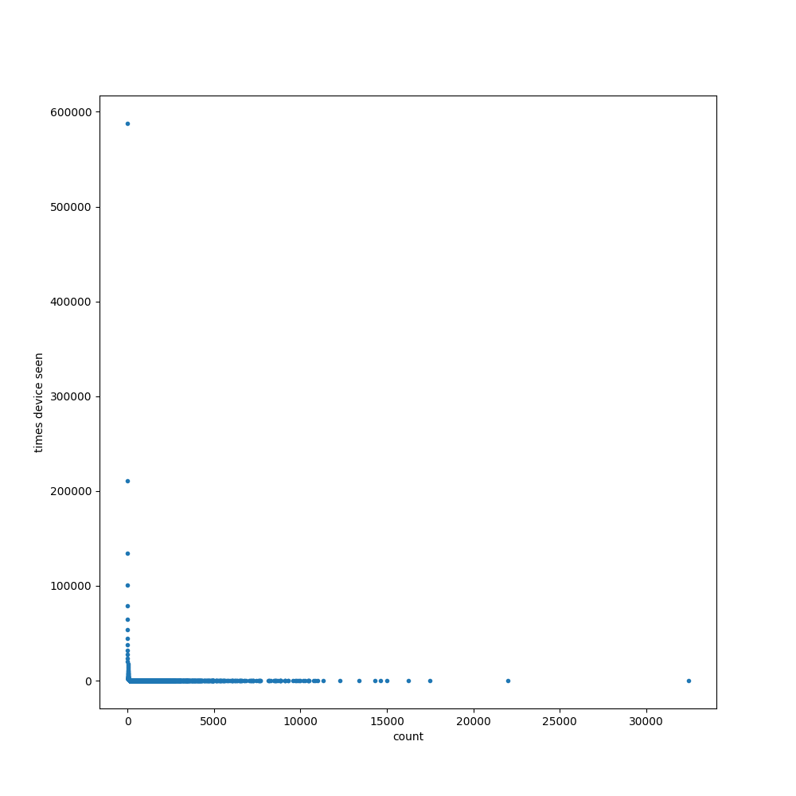

# onderzoeksvragen
- Onderscheid tussen (recreatieve) bezoekers en andere passanten (werkenden, bewoners): welke terugkeerpatronen zien we die kunnen duiden op bijvoorbeeld mensen die wonen of werken in de Binnenstad?
-
-
-

# Locatus data

## Apparaat vs personen
De locatus dataset is primair bedoeld om drukte te kunnen meten en daarop is gecontroleerd. Om gebruikerspatronen over langere tijd te kunnen meten is de dataset minder geschikt aangezien gebruikers niet over de hele duur gekoppeld kunnen worden aan 1 mobiel apparaat. De gemiddelde gebruikersduur van een mobiel ligt zo rond de 1,5 a 2,5 jaar. Het is dus goed mogelijk dat een gebruiker in de 2,25 jaar aan data zijn mobiel heeft vervangen. Ook is het mogelijk dat een persoon zijn oude telefoon doorverkoopt en dat met 1 apparaat het gedrag van meerdere personen wordt gemeten.

### Voorbeeld personen die over de gehele dataset zijn gemeten

### Voorbeeld personen die waarschijnlijk mobiel / baan / woning / ... hebben gewisseld

## Detectie vs passage
Niet elke detectie betekent een passage, zo worden enkele gebruikers vaak de hele nacht door geregistreerd. Het is waarschijnlijk dat dit signaal is opgepikt uit een huis en niet op de straat.

Snelle passages worden niet gemeten. Mobieltjes zoeken eens in de zoveel seconden naar netwerken, als iemand snel passeert dan is de kans groot dat zijn mobiel niet wordt geregistreed.

# Gebruikers patronen
Onderscheid reguliere bezoekers, incidentele bezoekers

## Aantal detecties
De onderste punten zijn apparaten die slechts weinig keer zijn gedetecteerd.
De linker punten zijn apparaten die heel vaak zijn gedetecteerd.
In de uitlopers is er een onderscheid te maken tussen incidenteel en regulier.

Dit verband is logartimisch, slecht zichtbaar in de vorige grafiek.
Met logartimische assen levert dit het onderstaande beeld waaruit blijkt dat er een geleidelijke verloop is tussen beide extremen.

## Verband tussen regelmaat en aantal detecties.
Bewoners / werkenden hebben waarschijnlijk vastere patronen dan recreatieve bezoekers. Het is daarom interresant om te kijken naar de regelmaat van een bezoeker over een bepaalde periode. Een wekelijkse periode is daarbij voordehand liggend aangezien de meeste mensen een stabiel weekritme hebben, in tegenstelling tot dag, maand of jaar.
Regelmaat is in onderstaande grafiek uitgedrukt in de afwijking van het gemiddeld weekritme per uur en uitgezet tov het aantal detecties.

Dit levert ook een logaritmisch verband.

Passanten die vaak worden geregistreed hebben een stabieler ritme dan passanten die minder vaak in het centrum komen.
Helaas levert dit geen duidelijk onderscheid tussen 2 groepen: bewoners/werknemers en recreatieve passanten.

## Andere methoden
Het zou kunnen dat er een andere maat is waarbij wel een duidelijke onderscheid valt waar te nemen tussen de twee groepen. Het is ook goed mogelijk dat er geen strikt onderscheid bestaat.

### Voorbeelden

Incidentele bezoeker

Incidentele bezoeker

Incidentele bezoeker

Regelmatige bezoeker

Regelmatige bezoeker, bewoner?

Regelmatige bezoeker, bewoner?

Regelmatige bezoeker, winkeleigenaar?

Regelmatige bezoeker, postbode?

Vakantiebaan?

Vakantiebaan?

Vaak op di, wo en vr aanwezig, maar vaak ook niet.

Verspreid over de week, vaak ook niet. Bewoner / werknemer of bezoeker?

ma, di wo, do. Werknemer of leverancier?

Iemand die regelmatig uit gaat in het centrum.

Meestal op wo een uurtje.

Elke dag van de week, vaak niet.

Elke dag van de week, met name op zaterdag, vaak niet.

### Mogelijke typeringen van gebruiker
In de uitersten van de dataset zijn duidelijke patronen te herkennen. Zo kunnen een aantal patronen worden onderscheiden:
- Bewoner, veel aanwezig, 7 dagen per week, ook s'nachts
- Werknemer, veel aanwezig, aantal dagen per week, met name in blokken van korter dan 8 uur
- Werknemer/bewoner passant, veel aanwezig, aantal dagen per week, met name 2 maal gezien per dag rond blokken van korter dan 8 uur
- Incidentele bezoeker, iemand die slechts een paar dagen is gespot

Hiertussen zit een grijs gebied.
- Postbodes, regelmatig, max 1 maal per dag
- Leveranciers, regelmatig, 1 maal per week
- Vuilnisdienst, regelmatig x maal per week
- Schoonmakers, regelmatig x maal per week
- Bewaking / Politie, onregelmatig, vaak
- Geldtransport, onregelmatig, x maal per week
- Reguliere bezoekers die 1 x per week een visje op de markt halen, regelmatig
- Vakantie medewerkers, regelmatig maar beperkt in aantak weken
- Invalkrachten, 0 uren contract, onregelmatig
- Part time personeel met onregelmatige werktijden, onregelmatig
- Vaste vrijdag, zaterdag of zondag winkelaars, regelmatig met af en toe een lege week
- Mensen die in de buurt van een sensor wonen en onregelmatig langs de sensor lopen / fietsen, onregelmatig vaak.

## Unsupervised learning
Zonder duidelijk onderscheid tussen twee groepen is het lastig om met unsupervised learning de groep betrouwbaar op te splitsen in twee groepen. Methodes kunnen ook niet getest worden adhv een betrouwbare test set.

## Supervised learning
Ipv unsupervised learning is het ook mogelijk om een deel van de dataset op een aantal veelvoorkomende patronen te classifiserenen hierop supervised learning toe te passen. Bijvoorbeeld: bewoner, werknemer, vakantiemedewerker, uitgaansleven, weekendshopper, etc. Met een dergelijke dataset kan dan ook een uitspraak worden gedaan over de betrouwbaarheid van de modelering.

## Image recognition, deep learning
Bepaalde patronen zijn voor een mens makkelijk te herkennen in de grafieken. Met een Inception v3 neuraal netwerk zijn bepaalde patronen makkelijk automatisch te herkennen.
- Opdeling in 5 groepen:
    - regular (bewoner/werknemer),
    - once (recreatieve bezoekers die 1 dag zijn gedetecteerd)
    - incidental (recreatieve bezoekers die meerdere dagen zijn gedetecteerd)
    - between (een vage tussen categorie waarvan ik zelf niet weet hoe ik de gebruiker moet classificeren)
    - holiday (mensen die een paar weken veel gedetecteerd zijn)
- Ongeveer 20 grafieken per groep
- TensorFlow
- Inception v3
- Opnieuw getrained

### Voorbeeld uitkomsten

- regular 0.86244684
- between 0.12731232
- holiday 0.009794244
- incidental 0.00040497325
- once 4.1682535e-05

- incidental 0.9879429
- holiday 0.006636714
- once 0.0039529866
- between 0.0011689693
- regular 0.00029848912

- once 0.93184984
- incidental 0.06384625
- between 0.0019799476
- holiday 0.0019307188
- regular 0.00039328312

- incidental 0.9135688
- once 0.054632265
- holiday 0.014076398
- between 0.014001362
- regular 0.003721056

- regular 0.99423146
- between 0.0057454375
- holiday 2.2895143e-05
- incidental 1.8406993e-07
- once 1.1046355e-08

- holiday 0.44549683
- regular 0.27471495
- between 0.27150056
- incidental 0.007863182
- once 0.00042449663

- holiday 0.811669
- between 0.080748476
- incidental 0.08008464
- once 0.018068189
- regular 0.00942965
