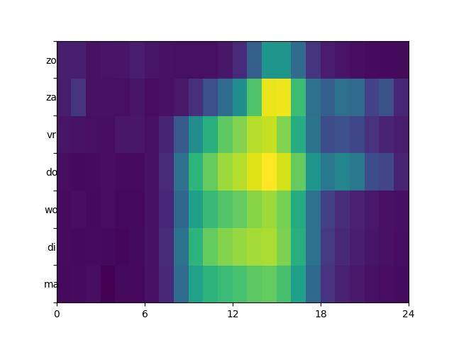
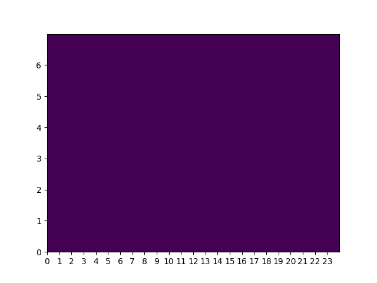
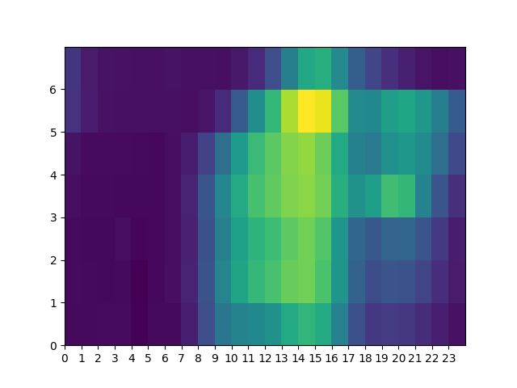
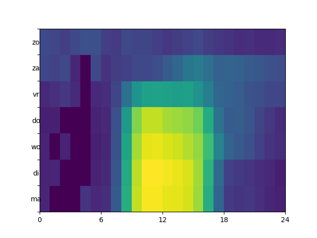
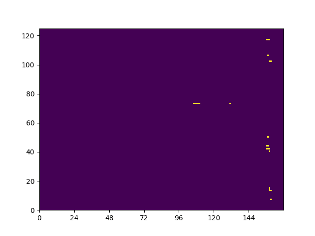
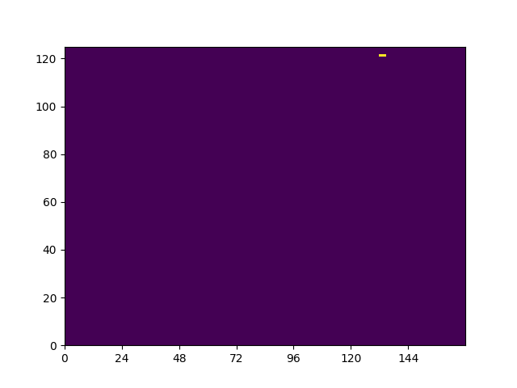
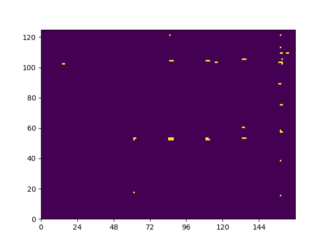
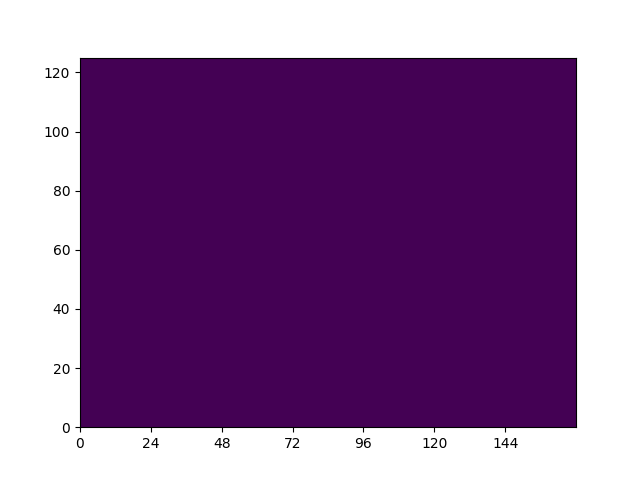

# Parkeren in Leeuwarden

## Dataset
De datasets bevatten een aantal hyaten. Vele start en eindtijden missen bij de parkeergarage set, sommige parkeerduren zijn negatief en sommige hebben een lengte van 0 seconden. Veel entries van de straat data bevatten geen parkeer duur.

De parkeergarageset bevat 3.380.160 items, hiervan hebben:
 - 37.956 geen starttijd (~1%)
 - 99.518 geen eindtijd (~3%)
 - 20 een negatieve parkeerduur
 - 269 een parkeerduur van 0 seconden
 - 11.152 kort parkeren items hebben een parkeerduur van meer dan een dag

De maximale parkeerduur is 120 dagen, die voor kort parkeren 108 dagen.

## Analyse
Door de hyaten in de dataset is het lastig conclussies te trekken uit de data, hiervoor zullen een aantal aannames moeten worden gedaan.

Aanname 1: De parkeergarage dataset is geordend op start tijd, bij de missende start tijden kan als benadering het voorgaande item worden aangenomen.
Aanname 2: Bij missende eindtijden kan worden verondersteld dat er een maximale parkeerduur is. Vreemd genoeg zijn bij de aanname van 0 seconden parkeerduur veel parkeergarages alsnog gevuld tot boven de capaciteit.
Aanname 3: De parkeergarages waren leeg bij het begin en het eind van de meting. Dit is hoogst onwaarschijnlijk.
Aanname 4: De straat parkeer items met een duur van 0 seconden kunnen worden genegeerd.

## Resultaten
Ondanks dat er is aangenomen dat de parkeergarages leeg zijn bij het begin van de meting en dat items met een missende eindtijd een duur hebben van 0 seconden hebben 4 van de 5 garages een maximaal aantal auto's bevat die hoger is dan de capaciteit. Het kan natuurlijk zo zijn dat er meer auto's worden toegelaten dan de capaciteit. Op basis van de uitstroom en de gemiddelde tijd die iemand nodig heeft om de garage uit te rijden kan worden berekend hoeveel plekken er ongeveer vrij zijn ondanks dat de capaciteit is bereikt.

### Gemiddelde bezetting garages per weekdag per uur

### Volle garages per jaarweek per daguur

