# Parkeren in Leeuwarden

## Dataset
De datasets bevatten een aantal hyaten. Vele start en eindtijden missen bij de parkeergarage set, sommige parkeerduren zijn negatief en sommige hebben een lengte van 0 seconden. Veel entries van de straat data bevatten geen parkeer duur.

De parkeergarageset bevat 3.380.160 items, hiervan hebben:
 - 37.956 geen starttijd (~1%)
 - 99.518 geen eindtijd (~3%)
 - 555.006 geen betaaltijd (~16%)
 - 355.064 geen betaaltijd en abonnement (~10%)
 - 199.942 geen betaaltijd en kort parkeren (~6%)
 - 20 een negatieve parkeerduur
 - 269 een parkeerduur van 0 seconden
 - 11.152 kort parkeren items hebben een parkeerduur van meer dan een dag

De maximale parkeerduur is 120 dagen, die voor kort parkeren 108 dagen.

### Geen betaaltijd
Abonnement houders hoeven natuurlijk niet te betalen. Een groot deel van de data zonder betaaltijd betreft inderdaad abonement houders.
Vreemd genoeg is er 10 keer door een abbonementhouder wel betaald bij de automaat.
```
         transaction_id  garage_id  start_parking_dt    end_parking_dt    pay_parking_dt duration  card_type_id
47350            941740         38   15-1-2016 15:34   16-1-2016 13:35   16-1-2016 13:32 22:01:00           221
352273          3095076         36    4-4-2016 09:06    4-4-2016 21:17    4-4-2016 09:09 12:11:00           221
507332           989991         38   17-5-2016 07:04   17-5-2016 15:30   17-5-2016 15:30 08:26:00           221
851334          1769424         37   22-8-2016 09:13               NaN   22-8-2016 09:13      NaT           221
1101920         3472183         36  28-10-2016 13:56  28-10-2016 19:13  28-10-2016 18:32 05:17:00           221
1110677         3476812         36  30-10-2016 12:09  30-10-2016 14:15  30-10-2016 14:08 02:06:00           221
1444523         1848602         37   16-1-2017 08:14   16-1-2017 15:59   16-1-2017 15:47 07:45:00           221
2360089         1163680         38   10-9-2017 12:23   10-9-2017 17:40   10-9-2017 17:19 05:17:00           221
2447917         2274941         39   2-10-2017 07:24   2-10-2017 16:00   2-10-2017 07:26 08:36:00           221
2510639         2291129         39  16-10-2017 07:41  16-10-2017 16:21  16-10-2017 07:44 08:40:00           221
```

Uit de csv
```
38;221;941740;"15-1-2016 15:34";"16-1-2016 13:35";"16-1-2016 13:32";588;595;591
36;221;3095076;"4-4-2016 09:06";"4-4-2016 21:17";"4-4-2016 09:09";989;999;992
38;221;989991;"17-5-2016 07:04";"17-5-2016 15:30";"17-5-2016 15:30";588;595;591
```

Bij kort parkeren zou altijd betaald moeten zijn. Dat is in 199.942 gevallen niet gebeurt volgens de data.
```
         garage_id start_parking_dt   end_parking_dt pay_parking_dt duration  card_type_id
9               36   1-1-2016 00:40              NaN            NaN      NaT           220
63              36   1-1-2016 06:07   1-1-2016 06:10            NaN 00:03:00           220
69              36   1-1-2016 10:52   1-1-2016 15:17            NaN 04:25:00           220
80              36   1-1-2016 12:28              NaN            NaN      NaT           220
94              36   1-1-2016 13:49   1-1-2016 13:54            NaN 00:05:00           220
96              36   1-1-2016 13:55   1-1-2016 13:58            NaN 00:03:00           220
130             36   1-1-2016 14:47   1-1-2016 14:48            NaN 00:01:00           220
150             36   1-1-2016 15:49   1-1-2016 15:52            NaN 00:03:00           220
154             36   1-1-2016 15:54   1-1-2016 15:55            NaN 00:01:00           220
164             36   1-1-2016 16:08   1-1-2016 18:33            NaN 02:25:00           220
200             36   1-1-2016 17:35              NaN            NaN      NaT           220
217             36   1-1-2016 18:00   1-1-2016 20:57            NaN 02:57:00           220
352             38   2-1-2016 07:23              NaN            NaN      NaT           220
360             37   2-1-2016 07:52              NaN            NaN      NaT           220
362             38   2-1-2016 07:57              NaN            NaN      NaT           220
396             38   2-1-2016 08:55              NaN            NaN      NaT           220
409             38   2-1-2016 09:01              NaN            NaN      NaT           220
411             37   2-1-2016 09:02   2-1-2016 18:34            NaN 09:32:00           220
425             37   2-1-2016 09:09   2-1-2016 18:57            NaN 09:48:00           220
439             38   2-1-2016 09:17              NaN            NaN      NaT           220
442             36   2-1-2016 09:18   2-1-2016 10:31            NaN 01:13:00           220
455             37   2-1-2016 09:24   2-1-2016 10:48            NaN 01:24:00           220
457             36   2-1-2016 09:25   2-1-2016 11:31            NaN 02:06:00           220
460             37   2-1-2016 09:25   2-1-2016 17:18            NaN 07:53:00           220
466             37   2-1-2016 09:27   2-1-2016 18:27            NaN 09:00:00           220
471             36   2-1-2016 09:29   2-1-2016 20:30            NaN 11:01:00           220
521             36   2-1-2016 09:42   2-1-2016 10:57            NaN 01:15:00           220
556             36   2-1-2016 09:48   2-1-2016 11:05            NaN 01:17:00           220
603             36   2-1-2016 09:57   2-1-2016 10:01            NaN 00:04:00           220
627             39   2-1-2016 10:00   2-1-2016 12:03            NaN 02:03:00           220
...            ...              ...              ...            ...      ...           ...
3377734         36              NaN  31-3-2018 13:57            NaN      NaT           220
3377756         36  31-3-2018 13:59              NaN            NaN      NaT           220
3378002         38  31-3-2018 14:21  31-3-2018 14:31            NaN 00:10:00           220
3378253         37  31-3-2018 14:43  31-3-2018 14:46            NaN 00:03:00           220
3378366         38  31-3-2018 14:57  31-3-2018 15:01            NaN 00:04:00           220
3378528         37  31-3-2018 15:14              NaN            NaN      NaT           220
3378592         37  31-3-2018 15:21              NaN            NaN      NaT           220
3378609         38  31-3-2018 15:23  31-3-2018 15:28            NaN 00:05:00           220
3378618         36  31-3-2018 15:24              NaN            NaN      NaT           220
3378688         37  31-3-2018 15:30              NaN            NaN      NaT           220
3378816         39  31-3-2018 15:47              NaN            NaN      NaT           220
3378849         38  31-3-2018 15:52  31-3-2018 19:39            NaN 03:47:00           220
3378999         36  31-3-2018 16:21              NaN            NaN      NaT           220
3379014         37              NaN  31-3-2018 16:25            NaN      NaT           220
3379025         36  31-3-2018 16:27  31-3-2018 16:30            NaN 00:03:00           220
3379120         39              NaN  31-3-2018 17:00            NaN      NaT           220
3379175         39              NaN  31-3-2018 17:18            NaN      NaT           220
3379228         36              NaN  31-3-2018 17:28            NaN      NaT           220
3379378         38              NaN  31-3-2018 18:07            NaN      NaT           220
3379394         36  31-3-2018 18:15  31-3-2018 18:16            NaN 00:01:00           220
3379577         39  31-3-2018 18:57  31-3-2018 18:58            NaN 00:01:00           220
3379578         39  31-3-2018 18:58              NaN            NaN      NaT           220
3379724         36  31-3-2018 19:42              NaN            NaN      NaT           220
3379738         36  31-3-2018 19:48  31-3-2018 19:50            NaN 00:02:00           220
3379786         38  31-3-2018 20:05  31-3-2018 20:12            NaN 00:07:00           220
3379790         36              NaN  31-3-2018 20:06            NaN      NaT           220
3379797         38  31-3-2018 20:08  31-3-2018 20:16            NaN 00:08:00           220
3379989         39  31-3-2018 20:57  31-3-2018 20:59            NaN 00:02:00           220
3380015         38  31-3-2018 21:09   1-4-2018 01:09            NaN 04:00:00           220
3380079         36  31-3-2018 22:03              NaN            NaN      NaT           220
```

### Items met een negatieve parkeerduur.
- Alle binnen 1 uur negatief.
- 3 verschillende parkeergarages: 36, 38 en 39.
- Waarvan 3 die betaald hebben.
- Op twee verschillende dagen.
- 30-10-2016 was het begin van de wintertijd, klok 1 uur terug.
- Begin zomertijd 2018 was op 25-3-2018, klok 1 uur vooruit.
```
         garage_id  start_parking_dt    end_parking_dt          duration
1110207         36  30-10-2016 02:29  30-10-2016 02:19 -1 days +23:50:00
2871494         39    3-4-2018 13:56    3-4-2018 13:45 -1 days +23:49:00
2871537         39    3-4-2018 14:02    3-4-2018 13:35 -1 days +23:33:00
2871560         39    3-4-2018 14:05    3-4-2018 13:47 -1 days +23:42:00
2871565         39    3-4-2018 14:06    3-4-2018 13:40 -1 days +23:34:00
2871587         39    3-4-2018 14:09    3-4-2018 13:49 -1 days +23:40:00
2871598         38    3-4-2018 14:10    3-4-2018 13:51 -1 days +23:41:00
2871613         39    3-4-2018 14:12    3-4-2018 14:09 -1 days +23:57:00
2871620         39    3-4-2018 14:13    3-4-2018 14:04 -1 days +23:51:00
2871628         39    3-4-2018 14:15    3-4-2018 13:45 -1 days +23:30:00
2871636         39    3-4-2018 14:16    3-4-2018 14:07 -1 days +23:51:00
2871637         38    3-4-2018 14:17    3-4-2018 13:52 -1 days +23:35:00
2871643         39    3-4-2018 14:18    3-4-2018 14:15 -1 days +23:57:00
2871653         39    3-4-2018 14:19    3-4-2018 13:58 -1 days +23:39:00
2871663         39    3-4-2018 14:20    3-4-2018 13:57 -1 days +23:37:00
2871666         39    3-4-2018 14:20    3-4-2018 13:38 -1 days +23:18:00
2871684         39    3-4-2018 14:23    3-4-2018 13:42 -1 days +23:19:00
2871720         39    3-4-2018 14:28    3-4-2018 13:41 -1 days +23:13:00
2871733         39    3-4-2018 14:30    3-4-2018 14:12 -1 days +23:42:00
2871735         39    3-4-2018 14:30    3-4-2018 13:52 -1 days +23:22:00
```

### Items met een parkeerduur van 0.
- 269 items in totaal
- In alle garages
- Op willekeurige dagen
- Waarvan sommige een betaal tijdstip hebben.
```
         garage_id start_parking_dt   end_parking_dt   pay_parking_dt duration
20511           39   8-1-2016 21:55   8-1-2016 21:55              NaN   0 days
53076           39  16-1-2016 18:24  16-1-2016 18:24              NaN   0 days
69811           40  21-1-2016 18:49  21-1-2016 18:49              NaN   0 days
79689           39  23-1-2016 15:40  23-1-2016 15:40              NaN   0 days
87840           37  26-1-2016 12:36  26-1-2016 12:36              NaN   0 days
89523           39  26-1-2016 19:49  26-1-2016 19:49              NaN   0 days
96515           39  28-1-2016 15:09  28-1-2016 15:09              NaN   0 days
109129          39  30-1-2016 20:09  30-1-2016 20:09              NaN   0 days
109360          38  30-1-2016 21:17  30-1-2016 21:17  30-1-2016 21:17   0 days
140820          40   8-2-2016 16:08   8-2-2016 16:08              NaN   0 days
...
3246160         39   1-3-2018 16:07   1-3-2018 16:07              NaN   0 days
3247671         39   1-3-2018 19:49   1-3-2018 19:49              NaN   0 days
3252377         37   2-3-2018 17:26   2-3-2018 17:26              NaN   0 days
3258006         39   3-3-2018 20:47   3-3-2018 20:47   3-3-2018 20:47   0 days
3260000         39   4-3-2018 17:24   4-3-2018 17:24              NaN   0 days
3281952         39   9-3-2018 20:38   9-3-2018 20:38              NaN   0 days
3299772         39  14-3-2018 15:57  14-3-2018 15:57              NaN   0 days
3332746         39  22-3-2018 12:46  22-3-2018 12:46              NaN   0 days
3341571         39  23-3-2018 21:03  23-3-2018 21:03              NaN   0 days
3376529         39  31-3-2018 12:15  31-3-2018 12:15              NaN   0 days
```

## Analyse
Door de hyaten in de dataset is het lastig conclussies te trekken uit de data, hiervoor zullen een aantal aannames moeten worden gedaan.

 - Aanname 1: De parkeergarage dataset is geordend op start tijd, bij de missende start tijden kan als benadering het voorgaande item worden aangenomen.
 - Aanname 2: Bij missende eindtijden kan worden verondersteld dat er een maximale parkeerduur is. Vreemd genoeg zijn bij de aanname van 0 seconden parkeerduur veel parkeergarages alsnog gevuld tot boven de capaciteit.
 - Aanname 3: De parkeergarages waren leeg bij het begin en het eind van de meting. Dit is hoogst onwaarschijnlijk.
 - Aanname 4: De straat parkeer items met een duur van 0 seconden kunnen worden genegeerd.

## Resultaten
Ondanks dat er is aangenomen dat de parkeergarages leeg zijn bij het begin van de meting en dat items met een missende eindtijd een duur hebben van 0 seconden hebben 4 van de 5 garages een maximaal aantal auto's bevat die hoger is dan de capaciteit. Het kan natuurlijk zo zijn dat er meer auto's worden toegelaten dan de capaciteit. Op basis van de uitstroom en de gemiddelde tijd die iemand nodig heeft om de garage uit te rijden kan worden berekend hoeveel plekken er ongeveer vrij zijn ondanks dat de capaciteit is bereikt.

### Garage 36
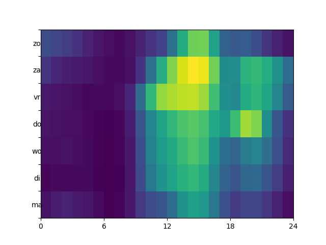
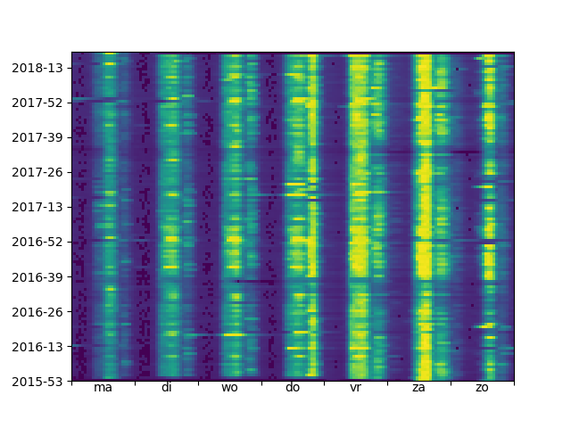
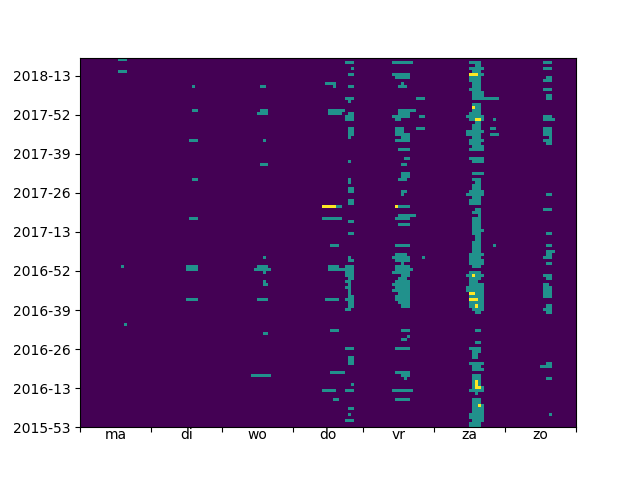
### Garage 37
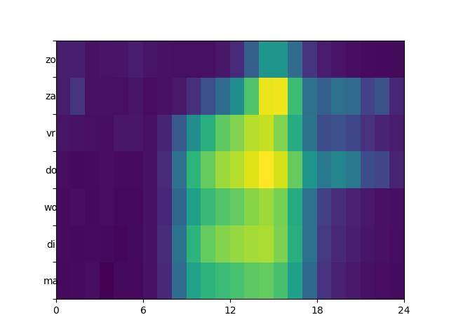
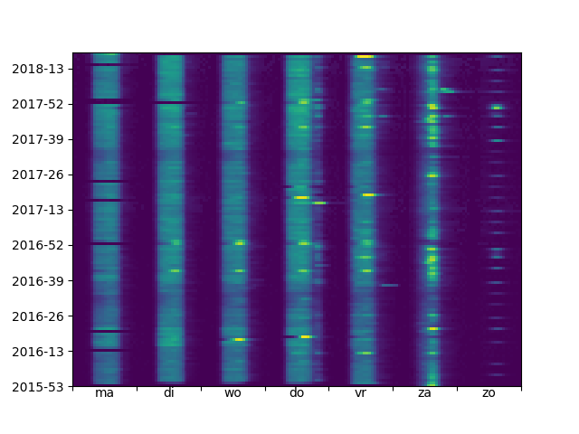
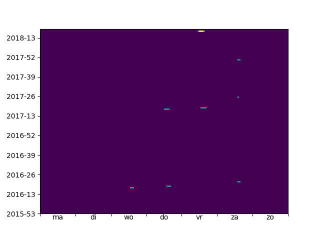
### Garage 38
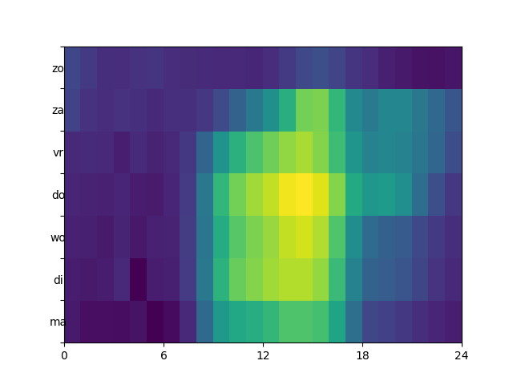
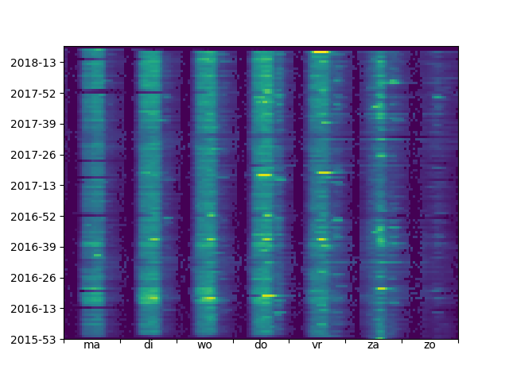
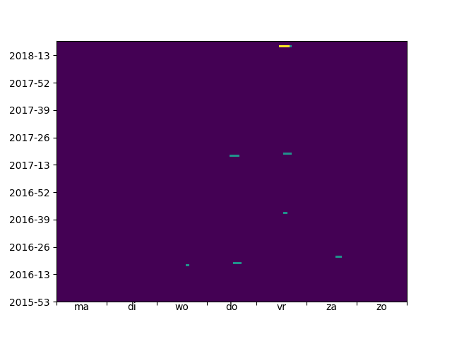
### Garage 39
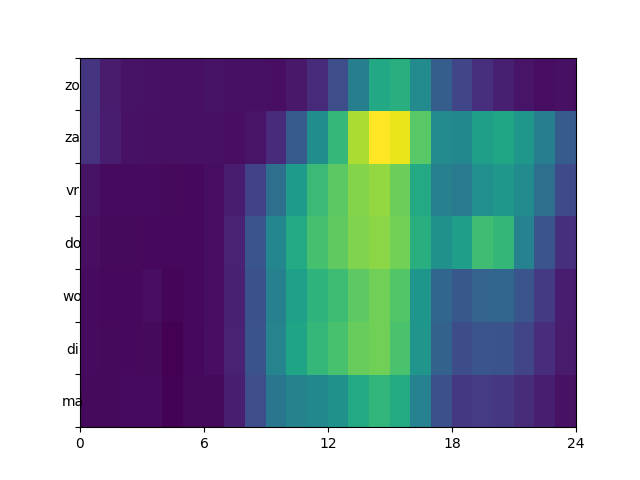
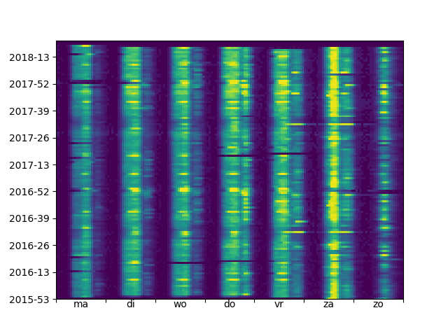
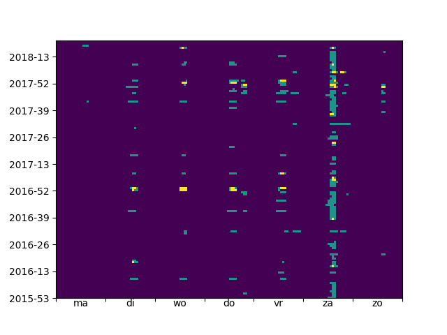
### Garage 40
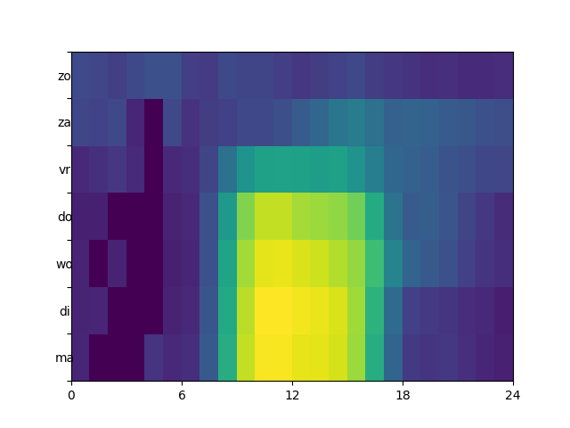
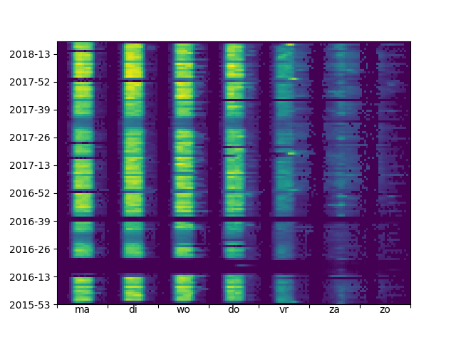
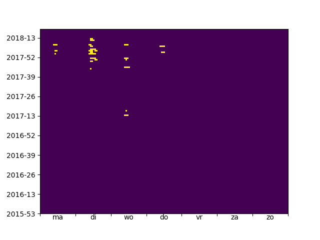

### Minimale en maximale bezetting
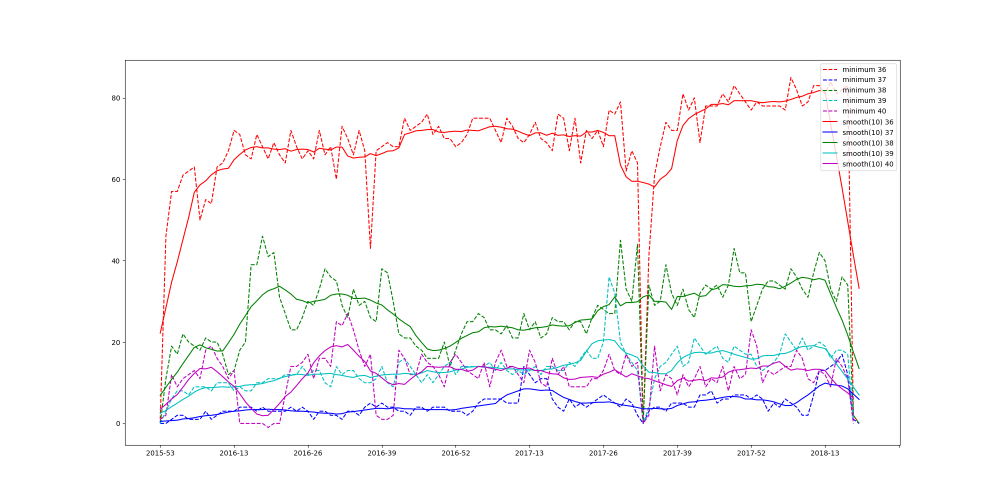
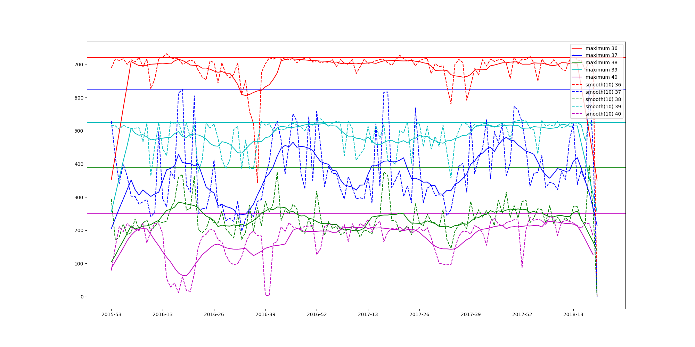
### De dag dat alle parkeergarages s'nacht leeg waren
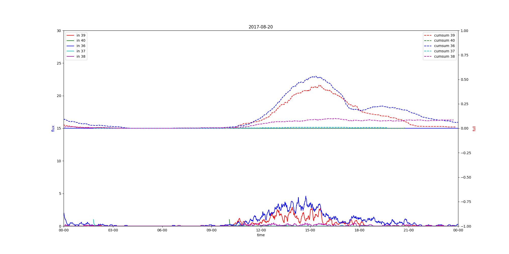

### Verschillen
In de parkeergarages zijn twee duidelijke verschillen waar te nemen. Er zijn parkeergarages die hoofdzakelijk doordeweeks worden gebruikt en parkeergarages die
met name op zaterdag piek momenten hebben.
- Bezoekers garages: 36, 39
- Doordeweekse garages: 38, 40
- Garage 37 heeft piekmomenten op donderdagmiddag en op zaterdag en verder een behoorlijke bezetting doordeweeks.

### Flux
Normaal gesproken is een garage vol als er zoveel auto's zijn geparkeerd als dat de capaciteit toelaat. De maximale bezetting over de jaren heen suggereert dat de data wat dit betreft ook hyaten heeft. Het is onwaarschijnlijk dat de maximale bezetting op de drukke dagen veel varieert en enigzins een verloop kent. Door een analyse uit te voeren van de instroom en uitstroom wordt dit bevestigd. Op vele van de drukke dagen lijkt de capaciteit te zijn bereikt terwijl de bezetting iets onder de capaciteit ligt. Op deze dagen wordt er plots een platau bereikt qua bezetting en is er tevens een plotselinge afname van de toevoer te zien die op dat moment grosso modo gelijk is aan de uitstroom. Dit suggereert dat op die momenten voor elke uitgaande auto een ingaande auto wordt toegelaten en een andere teller aangeeft dat de capaciteit is bereikt.

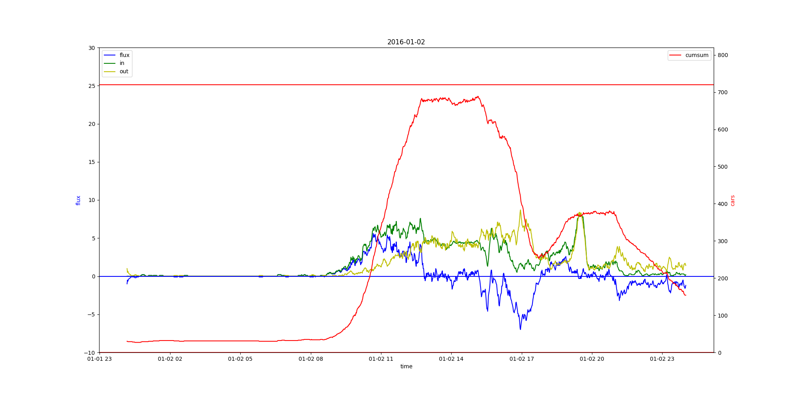
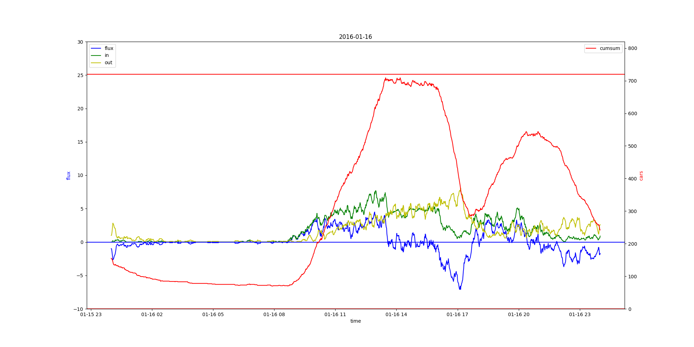

### Overloop naar andere garages

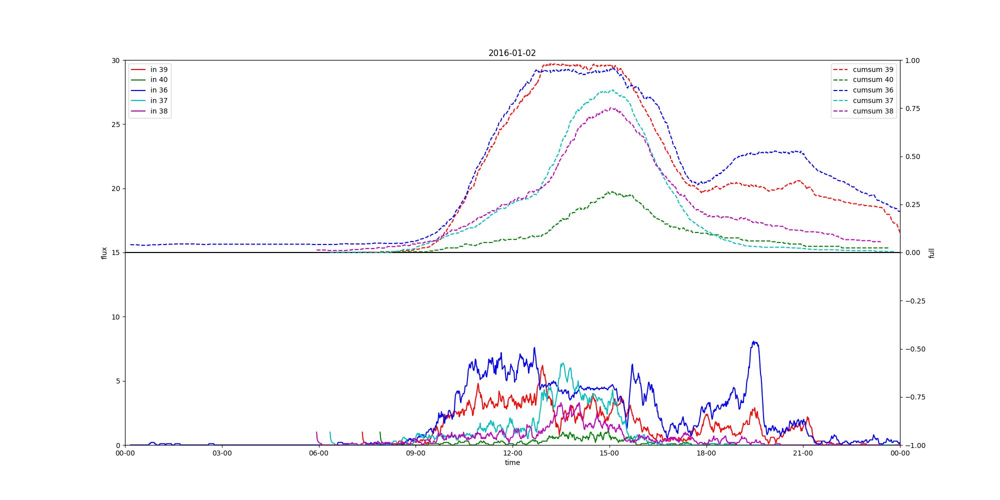
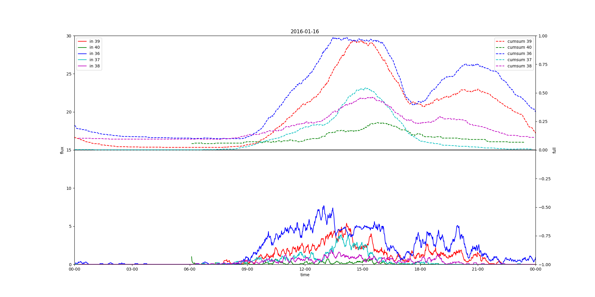
